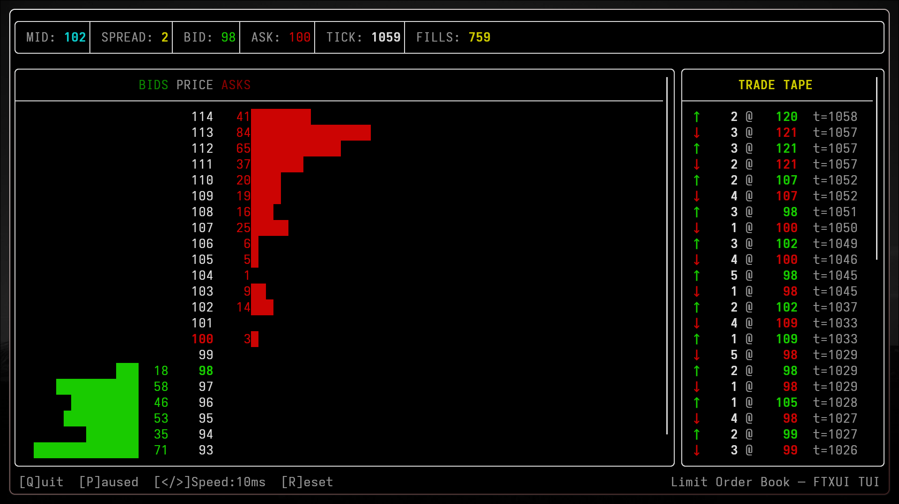
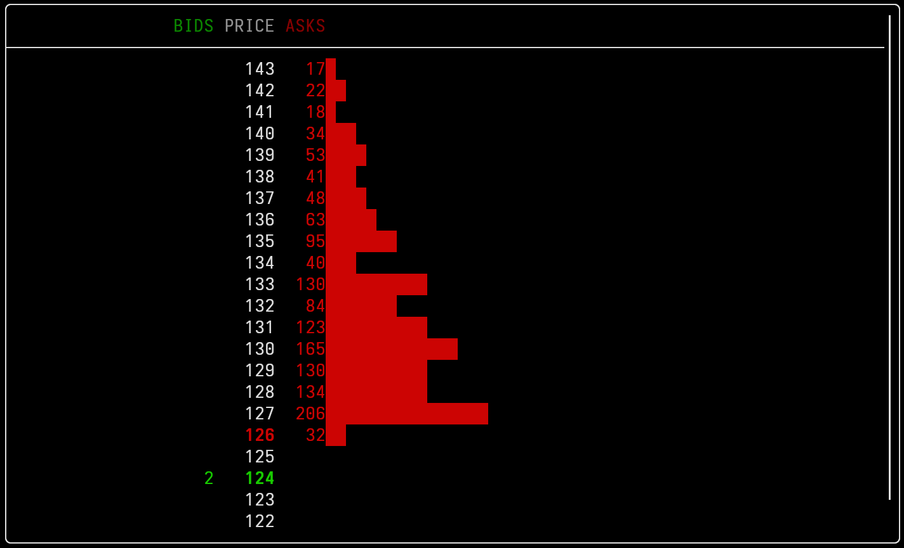

# Limit Order Book — A High-Throughput Matching Engine in C++

A real-time limit order book (LOB) simulation that demonstrates the core mechanics of modern electronic exchanges: continuous double-auction price discovery, price-time priority matching, and order-driven market microstructure.

<p align="center">
  
</p>

## Table of Contents

- [Why This Project?](#why-this-project)
- [What Is a Limit Order Book?](#what-is-a-limit-order-book)
- [Architecture](#architecture)
- [Data Structures & Complexity](#data-structures--complexity)
- [Matching Engine](#matching-engine)
- [Market Dynamics](#market-dynamics)
- [Build & Run](#build--run)
- [Sample Output](#sample-output)
- [Correctness Guarantees](#correctness-guarantees)
- [Performance](#performance)
- [TUI Visualization](#tui-visualization)
- [Further Reading](#further-reading)

---

## Why This Project?

Electronic markets run on matching engines — the software that pairs buyers with sellers, enforces price-time priority, and ensures fair execution at massive scale. Every trade you've ever placed, from a retail brokerage app to a high-frequency trading firm's colocated server, passed through something like this.

This project is a ground-up implementation of that central data structure, built with a few priorities in mind:

- **Correctness first.** A single bad fill erodes trust in the entire venue. Every invariant is explicit and verifiable.
- **Predictable, low-latency execution.** Data structure choices are deliberate and complexity-bounded.
- **Minimal abstractions.** The engine and visualization fit in four files — easy to reason about, easy to debug.

The goal is understanding how price-time priority matching works under the hood, with a codebase small enough to experiment on.

---

## What Is a Limit Order Book?

A limit order book is the canonical microstructure of modern financial markets. It maintains two sorted queues:

| Side  | Sorted by       | Best price is…                           |
|-------|-----------------|------------------------------------------|
| **Bids** | Price descending | Highest price someone is willing to buy  |
| **Asks** | Price ascending  | Lowest price someone is willing to sell  |

When the best bid meets or exceeds the best ask (`best_bid ≥ best_ask`), the book is **crossed** and a trade occurs. The matching engine continuously:

1. Accepts incoming orders (limit orders to buy or sell at a specific price and quantity).
2. Inserts each order into the correct side, maintaining price-time priority (earlier orders at the same price level are filled first).
3. Checks for crosses and executes fills at the resting order's price.
4. Removes fully-filled orders and cleans up empty price levels.

The **spread** (`best_ask − best_bid`) is the fundamental measure of liquidity and transaction cost in the market.

---

## Architecture

```
┌─────────────────────┐    ┌─────────────────────────┐
│      main.cpp       │    │        tui.cpp           │
│   (console output)  │    │   (FTXUI DOM ladder)     │
└─────────┬───────────┘    └───────────┬─────────────┘
          │                            │
          └──────────┬─────────────────┘
                     ▼
┌────────────────────────────────────────────────────┐
│                  Simulation Core                    │
│  ┌───────────────┐   ┌───────────────────────────┐ │
│  │  Mid-Price RW │──▶│    Order Generation        │ │
│  │ (MID_STEP_    │   │  generate_order(mid)       │ │
│  │  EVERY ticks) │   │  (min-of-3 clustered)      │ │
│  └───────────────┘   └───────────┬───────────────┘ │
│                                  │                  │
│                                  ▼                  │
│  ┌───────────────────────────────────────────────┐ │
│  │        Order Book (sliding-window array)      │ │
│  │  ┌──────────┐                ┌──────────┐     │ │
│  │  │   BIDS   │                │   ASKS   │     │ │
│  │  │[0..255]  │                │[0..255]  │     │ │
│  │  │price−base│                │price−base│     │ │
│  │  └──────────┘                └──────────┘     │ │
│  └──────────────────┬────────────────────────────┘ │
│                     │                              │
│                     ▼                              │
│  ┌───────────────────────────────────────────────┐ │
│  │           Matching Engine Loop                │ │
│  │  while (best_bid ≥ best_ask):                 │ │
│  │    fill_vol = min(bid_qty, ask_qty)           │ │
│  │    decrement both → remove if empty           │ │
│  │    recalc best_bid / best_ask via cached idx  │ │
│  └───────────────────────────────────────────────┘ │
│                     │                              │
│                     ▼                              │
│     Output: console → best_bid | best_ask         │
│             TUI     → DOM ladder + trade tape     │
└────────────────────────────────────────────────────┘
```

### Source Files

| File          | Lines | Purpose                                                   |
|---------------|-------|-----------------------------------------------------------|
| `common.h`    |  ~50  | Data structures (`Order`), constants, function signatures |
| `orders.cpp`  |  ~35  | Order generation (`generate_order`, min-of-3 clustering)  |
| `main.cpp`    | ~230  | Simulation loop, matching engine, console I/O             |
| `tui.cpp`     | ~500  | FTXUI-based DOM ladder, trade tape, keyboard controls     |

---

## Data Structures & Complexity

The choice of data structures is deliberate and reflects real-world exchange engineering tradeoffs.

### Sliding-Window Flat Array — Per Side

Instead of a red-black tree, each side of the book uses a pre-allocated flat array of deques with a sliding base offset:

```
BIDS (index = price - base, 256 slots)
──────────────────────────────────────
       base = 66          base + 128 (mid ≈ 194)
       ↓                  ↓
  [0]  [1] … [63] [64]   …   [191] [192] … [255]
  empty          price=130      price=192
                 [O₁, O₂]       [O₃]
```

- **Flat array** (`std::deque<Order>[WINDOW_SIZE]`): `O(1)` insertion, deletion, and price-level access. Finding the best price is a linear scan of contiguous memory — cache-friendly and branch-predictable. A cached `best_idx` avoids re-scanning the full window on every fill.
- **Sliding base offset** (`base_price`): The window shifts when the mid-price drifts too close to an edge. Only active orders in the overlap region are relocated (a few dozen at most). The window is 4× the active range (`MAX_MID_DISTANCE * 2`), so recentering is infrequent.
- **`std::deque`** per price level: `O(1)` push-back and pop-front. Enforces **price-time priority** — orders at the same price level are filled in arrival order (FIFO). This is exactly the convention used by Reg NMS-compliant US equity exchanges.

### Operation Complexities

| Operation                          | Complexity        | Notes                                      |
|------------------------------------|-------------------|--------------------------------------------|
| Insert new order                   | `O(1)`            | Direct array index via `price - base`      |
| Get best bid / best ask (initial)  | `O(W)`            | `W` = WINDOW_SIZE (256, single scan/tick)  |
| Get best bid / best ask (update)   | `O(1)` amortized  | Walk from cached index to next level       |
| Fill (partial or complete)         | `O(1)`            | Decrement front of deque                   |
| Remove fully-filled order          | `O(1)`            | `pop_front()` on deque                     |
| Recenter window                    | `O(W)`            | Copy active orders to new positions (rare) |

### Memory

Each `Order` is 12 bytes (1-byte `bool` + 4-byte `unsigned` + 4-byte `unsigned` + 3 bytes padding on typical LP64). The `std::deque` introduces per-block overhead. Total resident memory per side: 256 deque objects (~80 bytes each) ≈ 20 KB. For both sides: ~40 KB — essentially nothing.

---

## Matching Engine

The core algorithm in `main.cpp` is a continuous matching loop:

```cpp
while (
    best_bid && best_ask &&  // both sides have resting orders
    best_bid >= best_ask     // the book is crossed
) {
    int bid_i = bids.best_idx;
    int ask_i = asks.best_idx;

    unsigned fill_vol = std::min(
        bids.levels[bid_i][0].quantity,
        asks.levels[ask_i][0].quantity
    );

    // Execute the fill
    bids.levels[bid_i][0].quantity -= fill_vol;
    asks.levels[ask_i][0].quantity -= fill_vol;

    // Garbage-collect filled orders
    if (bids.levels[bid_i][0].quantity == 0) {
        bids.levels[bid_i].pop_front();
        update_best_bid(bids);        // walk to next occupied slot
    }
    // ... symmetric for asks with update_best_ask() ...

    // Recalculate extremes for next iteration
    best_bid = (bids.best_idx >= 0)
        ? (unsigned)(base_price + bids.best_idx) : 0U;
    best_ask = (asks.best_idx >= 0)
        ? (unsigned)(base_price + asks.best_idx) : 0U;
}
```

### Design Decisions

1. **Price-time priority (FIFO per price level).** This is the standard in most regulated markets. It's fair, predictable, and incentivizes aggressive quoting (you want to be first in the queue at a given price).

2. **Trade price is the resting order's price.** When a new aggressive order arrives and crosses the spread, it fills against the resting order at the resting price — the maker receives price improvement from their perspective, the taker pays the spread. This is consistent with how most CLOB exchanges operate.

3. **Greedy matching.** The loop continues until the book is completely uncrossed. An incoming order can fill against multiple price levels if it's large enough — this is standard market behavior (walking the book).

4. **No explicit trade tape (console mode).** The console engine focuses on order state management and spread output. The TUI adds a rolling trade tape for visual feedback.

---

## Market Dynamics

### Mid-Price Random Walk

The mid-price follows a constrained random walk:

```
mid_price ∈ {mid_price - 1,  mid_price,  mid_price + 1}
```

A floor prevents the mid-price from falling below `MAX_MID_DISTANCE + 1` (enforcing that all generated order prices are positive — no zero or negative prices can enter the book). This creates a plausible — if simplified — model of a market where the "fair value" drifts over time while orders cluster around it.

### Order Generation

New orders are generated each tick with:
- **Side:** 50/50 buy or sell (Bernoulli trial)
- **Quantity:** Uniform random in `[1, MAX_ORDER_QTY]`
- **Price:** Non-uniform, clustered around the mid via **min-of-3 uniforms**:

  ```
  offset = min(U₁, U₂, U₃)         where Uᵢ ~ Uniform[0, MAX_MID_DISTANCE)
  ```

  This concentrates probability mass near zero:

  | Offset ≤ | Probability |
  |----------|-------------|
  | D × ⅓    | ~70%        |
  | D × ½    | ~88%        |
  | D × ⅔    | ~96%        |
  | D        | 100%        |

  A uniform distribution would place too many orders at the extremes, constantly sweeping away inner liquidity and producing a permanently wide spread. Clustering around the mid creates realistic book depth:

<p align="center">
  
  <br><em>Ask-side volume sloping upward — the closer to the mid, the more resting orders. This clustering around the best price is typical of real markets, where traders compete for queue priority at the tightest levels.</em>
</p>

These parameters are tunable in `common.h`:
```c
#define SLEEP_TIME       0.1   // seconds between iterations
#define MID_START        100    // initial mid-price
#define MID_STEP_EVERY   50     // ticks between mid-price random-walk steps
#define MAX_MID_DISTANCE 30     // max offset from mid
#define MAX_ORDER_QTY    10     // max order quantity
```

By adjusting `MAX_MID_DISTANCE` relative to the random walk step size, you can control the ratio of aggressive vs. passive orders: a wide range means more orders land far from the mid and rest in the book (adding liquidity); a narrow range means most orders cross the spread immediately (taking liquidity).

---

## Build & Run

### Requirements

- **Compiler:** C++17 (GCC ≥ 7, Clang ≥ 5)
- **Platform:** Linux, macOS, or WSL
- **Dependencies (console):** C++ standard library only
- **Dependencies (TUI):** [FTXUI](https://github.com/ArthurSonzogni/FTXUI)

### Build

```bash
# Both binaries via Makefile
make

# Console only
make lob

# TUI only
make lob-tui

# Manual console build (no dependencies)
g++ -std=c++17 -O2 -Wall -Wextra -o lob main.cpp orders.cpp
```

### Run

```bash
# Console mode — prints best_bid | best_ask per tick
./lob

# TUI mode — interactive terminal visualization
./lob-tui
```

The console program prints one line per tick indefinitely. Press `Ctrl+C` to stop.
The TUI mode opens a full interactive dashboard (see [TUI Visualization](#tui-visualization)).

---

## Sample Output

```
  101 │   103
  101 │   103
  100 │   102
   99 │   102
   99 │   100
   99 │    99      ← spread = 0: the book crossed and trades occurred
   99 │    99
   98 │   100
   98 │    99      ← spread = 1: just crossed again
   97 │    99
   97 │   100
  ...
```

When `best_bid ≥ best_ask`, the matching engine fills aggressively and the spread collapses to (or near) zero for that tick. In the next tick, new orders arrive and the spread typically widens again. Over time, the spread hovers around `MAX_MID_DISTANCE`, reflecting the balance between order arrival rate and fill aggressiveness.

---

## TUI Visualization

The TUI (`lob-tui`) renders a real-time Depth-of-Market (DOM) ladder powered by [FTXUI](https://github.com/ArthurSonzogni/FTXUI).

### Features

- **Price ladder** — vertical price column centered on the mid-price, with descending prices (high → low).
- **Bid bars (left)** — green horizontal bars showing resting buy volume at each price level. Bars fill from right to left (toward the center).
- **Ask bars (right)** — red horizontal bars showing resting sell volume at each level. Bars fill from left to right (toward the center).
- **Header** — live mid-price, spread, best bid/ask, tick counter, and cumulative fill count.
- **Trade tape (right panel)** — rolling log of recent fills, showing volume, price, aggressor direction (↑ buy, ↓ sell), and tick number.
- **Volume normalization** — bars scale relative to the largest visible level so the book always looks active.
- **Color highlights** — green for best bid, red for best ask, yellow for prices within the spread.

### Keyboard Controls

| Key        | Action                          |
|------------|---------------------------------|
| `Q`        | Quit                            |
| `P`        | Pause / resume simulation       |
| `>` / `.`  | Speed up (reduce tick interval) |
| `<` / `,`  | Slow down (increase tick interval) |
| `R`        | Reset (clear book, restart mid)  |

### Build

Requires [FTXUI](https://github.com/ArthurSonzogni/FTXUI) (the Makefile expects it at the path defined by `FTXUI_DIR`):

```bash
make lob-tui
```

The matching engine and order generation are shared with the console binary — the TUI is purely a visualization layer over the same simulation core.

---

## Correctness Guarantees

The engine maintains the following invariants at all times (between ticks):

1. **No crossed book.** After the matching loop exits, `best_bid < best_ask` or at least one side is empty. A crossed book post-match would imply a missed fill.

2. **Price-time priority.** Within each price level, the `std::deque` guarantees that orders are filled strictly in arrival order. A later order at the same price cannot be filled before an earlier one.

3. **Non-negative quantities.** Orders are removed from the book only when `quantity == 0` (after a decrement operation). Partial fills reduce the quantity; the order remains in the book for the remainder.

4. **No stale best-price pointers.** After a fill empties the best level, `update_best_bid()` / `update_best_ask()` walk to the next occupied slot in `O(1)` amortized time. Empty deques don't need explicit removal — they're zero-cost in the fixed array.

5. **Price bounds.** Order prices are always within `mid ± MAX_MID_DISTANCE`, and the mid-price is constrained to prevent underflow. No zero or negative prices can enter the book.

---

## Performance

Every core operation is `O(1)` except the per-tick best-price scan (`O(WINDOW_SIZE)` = 256 iterations) and the rare window recentering. In practice, the engine is I/O bound: `std::cout` per tick dominates wall-clock time. If you remove the `sleep()` call and suppress output, the loop runs fast enough that `rand()` becomes the bottleneck.

The flat-array design eliminates red-black tree overhead entirely — no pointer-chasing cache misses on best-price lookups, no rebalancing on insert/delete. For a simulation throttled to 10 Hz by `SLEEP_TIME`, the current design is far more than adequate.

---

## Further Reading

- [Order book (Wikipedia)](https://en.wikipedia.org/wiki/Order_book) — good overview of LOB mechanics and price-time priority
- [SEC Regulation NMS](https://www.sec.gov/rules-regulations/2005/06/regulation-nms) — the regulatory framework behind modern US equity market structure (Rules 610/611 on access and order protection)

---

*Built with C++17.*
